# Kiki Health Companion — Engineering Handoff

**SIH Problem Statement 26181 · A secure, AI-powered Personal Health Companion**

This document has two jobs.

**Part A — how Kiki actually works.** Kiki is a physical voice companion running on a Raspberry Pi 5 in a home in New Delhi. She is not a chatbot with a speaker attached. Almost everything interesting in this codebase exists because a real robot, in a real room, talking to a real person, has constraints a web app never has: a single GPU slot, a 7,000-token context window, a microphone that must not hear itself, and a person who will stop trusting her forever the first time she says something that isn't true.

**Part B — the UI you are building.** Kiki is the product. The app is how a caregiver configures her and sees what happened. Part B is the screen-by-screen and API spec for that app.

You do not need Part A to build the UI. Read it anyway — the constraints in it are why the API looks the way it does.

---

# Part A — How Kiki works

## 1. The whole system in one picture

Kiki is a Raspberry Pi 5 that orchestrates work across four places: itself, a laptop on the same Tailscale network doing the heavy neural lifting, a Hailo AI accelerator handling vision, and a few cloud APIs for the things that need a bigger brain.

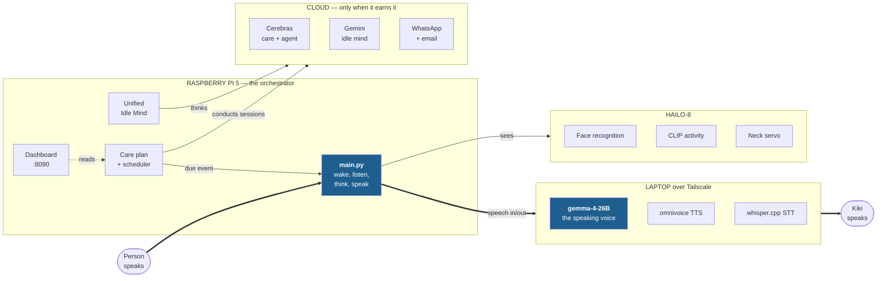

**The one rule that shapes everything:** the laptop runs llama.cpp with `-np 1` — a **single slot**. One request at a time runs fast. Every architectural decision below is about protecting that slot for the voice the person is waiting on.

---

## 2. The latency story — why Kiki answers in 1–2 seconds

This is the part engineers tend to find most interesting, and it is invisible in a demo unless you know to look for it.

Gemma is a **sliding-window attention** model. The laptop keeps a KV cache of the conversation so far. If the new request is a byte-for-byte extension of what's cached, the model only processes the new words — about **1.3 seconds**. If *anything* earlier in the conversation changed, it reprocesses everything — **24 to 60 seconds**.

That is a 20× cliff, and you fall off it by editing a single character in an old message.

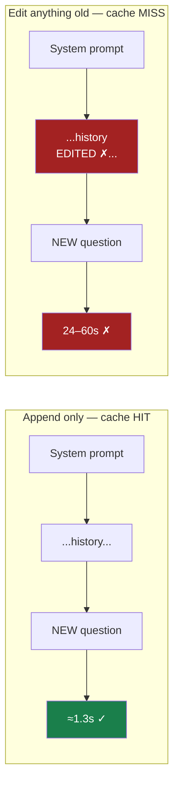

So the codebase enforces four hard rules:

| Rule | Why |
|---|---|
| **Never edit an existing message.** Only append. | Editing message #1 invalidates every token after it. An old bug rewrote a timestamp every 5 minutes and destroyed the cache every few turns. |
| **Store the reply *verbatim*** — including `<neck:left>` and `<tool_call>` tags. | The laptop's cache holds exactly what it generated. Storing a cleaned-up copy diverges from the cache at the first tag. Tags are stripped on a *separate* copy for speech. |
| **One warm-up at startup**, after context is final. | Two warm-ups race and invalidate each other. |
| **Background work must re-warm afterwards.** | Any background request evicts the speaking prefix. Every one auto-rewarms when it finishes. |

**Speech starts before the sentence is finished.** The model streams tokens; the moment a complete sentence appears, it is sent to the TTS server and starts playing while the model is still writing the next one.

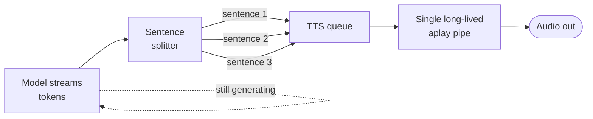

While the model is thinking, Kiki plays one short filler sound — the same trick a person uses when they say "hmm, let me think". It stops the instant real audio is ready.

---

## 3. Four brains, each with a job

Kiki does not have one model. She has four, and picking the wrong one for a task is the difference between a 1-second reply and a 6-second one.

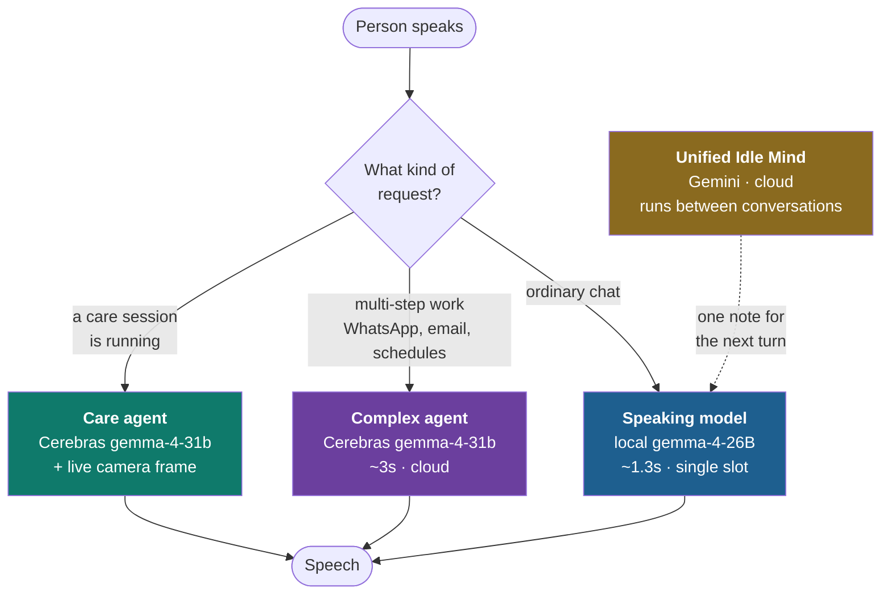

### The speaking model — local, fast, one tool at a time

Handles normal conversation. It sees a deliberately **small** tool list, because every tool description costs tokens in the warm prefix on *every single turn*. It can emit exactly one tool call per turn.

### The complex agent — for anything multi-step

"Check the messages in the family group and set a reminder if there's an event tomorrow" is structurally impossible for a one-tool-per-turn model. So it routes to a cloud agent that loops: call a tool, read the result, decide what's next, repeat.

Four guards exist on this path, and **every one of them was written after a real failure**:

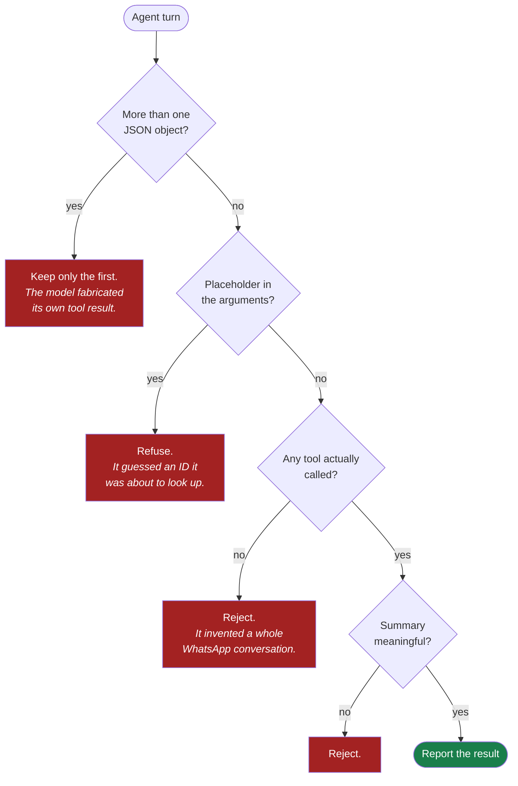

> **The principle underneath all four:** a latency regression is recoverable. A confident lie about whether a message was sent, or a medicine was taken, is not. Kiki must never say an action succeeded unless a tool actually returned success.

### Unified Idle Mind — the background thinker

Kiki thinks when nobody is talking to her. Every 15 seconds a monitor checks whether the conversation has genuinely lulled. If it has, one cloud session runs and decides for itself what to do: nothing, reflect, research something lightly, or research something deeply.

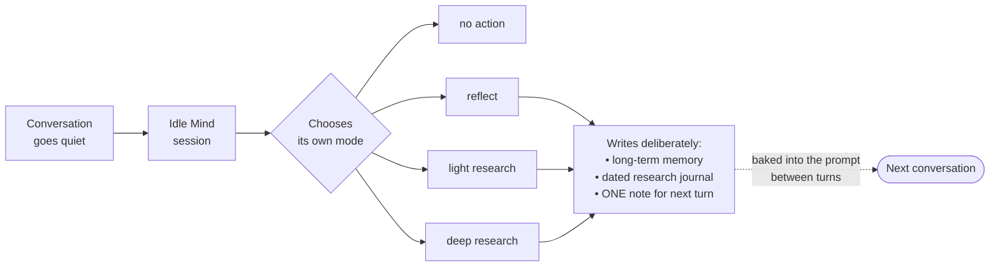

It is **cloud-only** and never touches the local slot, so it can never slow down speech. It is blocked from moving the robot, and blocked from sending messages on its own — a send requires the person to have actually asked.

---

## 4. The care plan — the person's whole day

`care_plan.json` is the single source of truth. It holds who the person is, their whole daily routine, their family contacts, confirmed outcomes, and trusted health readings.

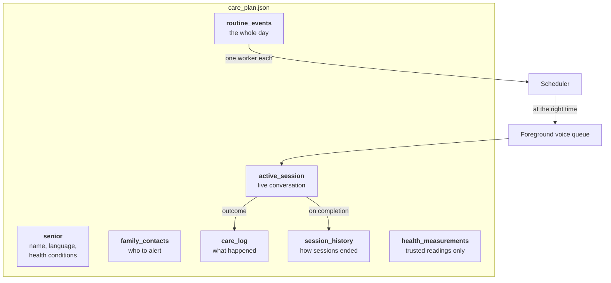

### A routine event is a *brief*, not a script

This is the most important design decision in the whole care system, and it is easy to get wrong.

A routine event does **not** contain the words Kiki will say. It contains a rich natural-language **hand-off** — the intended outcome and the known context — and the care agent decides how to actually conduct the conversation.

```mermaid
graph LR
    subgraph WRONG["✗ What we do NOT do"]
        W1["Step 1: say 'Time for your walk'"] --> W2["Step 2: wait"] --> W3["Step 3: say 'Great job'"]
    end

    subgraph RIGHT["✓ What we do"]
        R1["<b>session_brief</b><br/>Check in about moving today.<br/>Use the outside conditions —<br/>on a bad-air day, advising them<br/>to stay in is the RIGHT answer.<br/>Never imply they let anyone down."]
        R1 --> R2["Care agent conducts<br/>a real conversation"]
    end

    style WRONG fill:#3a1a1a
    style RIGHT fill:#1a3a2a
```

Why it matters: a scripted session cannot handle "my knee hurts today". A brief can. The person can interrupt, ask a question, change the subject, report pain, or stop — and it is still a normal conversation.

### A live care session

When a scheduled event comes due, the scheduler does **not** speak. It places a request on the normal foreground voice queue — the same queue the wake word uses. This is deliberate: it means the existing microphone lifecycle applies, so Kiki cannot transcribe her own voice as the person's answer.

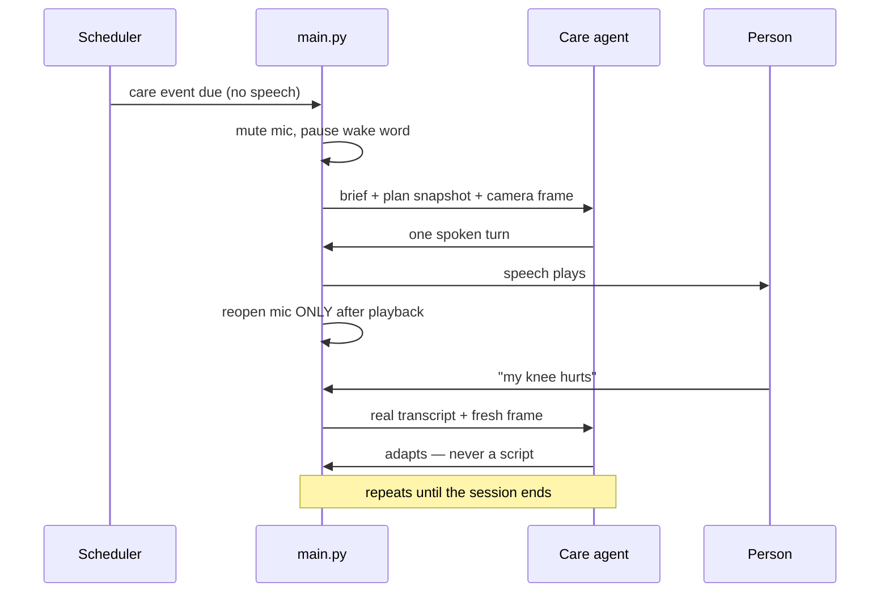

**Sessions must end.** This was a real bug: the care model was the only thing that could end a session, and its own prompt told it "usually, continue". One session ran eight turns, stayed open, blocked every other routine, and swallowed unrelated conversation for twenty minutes. There are now three deterministic closers underneath the model's judgement:

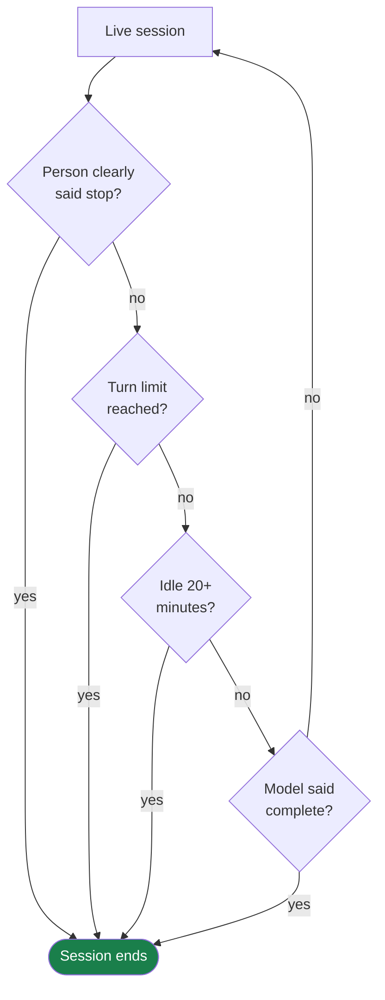

The stop detector is bilingual and deliberately careful: `"stop"` and `"बस"` end a session as a whole utterance, but *"I do not want to stop"* does not, and `"no"` / `"नहीं"` never do — those are the ordinary answer to "any pain?".

---

## 5. Eyes — how Kiki knows what someone is doing

A Hailo-8 accelerator runs CLIP against the camera and nominates activities: drinking, eating, taking medicine, sleeping, heat distress, exercising, wearing a mask, using a walking aid, head in hands, wrapped in a blanket, slumped forward.

**CLIP only nominates. Five gates decide.** Each is cheaper than the next, so the expensive judgement runs on a handful of candidates per hour rather than 30 frames a second.

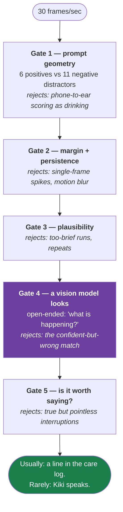

Three details worth knowing, because each was learned the hard way:

- **Write prompts for pixels, not meaning.** CLIP cannot see *water* — only a vessel travelling to a mouth. `"person raising a cup or bottle to their mouth"` works where `"person drinking water"` cannot. Naming the drink is Gate 4's job.
- **Gate 4 never asks a leading question.** "Is she drinking?" invites a yes. It asks what the person is doing, open-ended, then tests whether the free answer *entails* the activity. "Unclear" counts as a rejection, and any vision failure **fails closed**.
- **A detector that cries wolf is worse than no detector.** An `unsteady` prompt fired 9 times in 10 minutes on a healthy person because CLIP cannot separate *steadying yourself* from *standing near a wall*. It was **removed**, not tuned.

> **The rule that matters for the UI:** an empty camera frame means the camera is empty. It never means someone has fallen. Fall detection is explicitly **out of scope** until there is a wearable — a CLIP-only fall detector that misfires trains the person to ignore it.

---

## 6. Health and environment signals

This is what makes Kiki a *health* companion rather than a reminder app, and it maps directly onto the problem statement's heat waves, floods and pollution events.

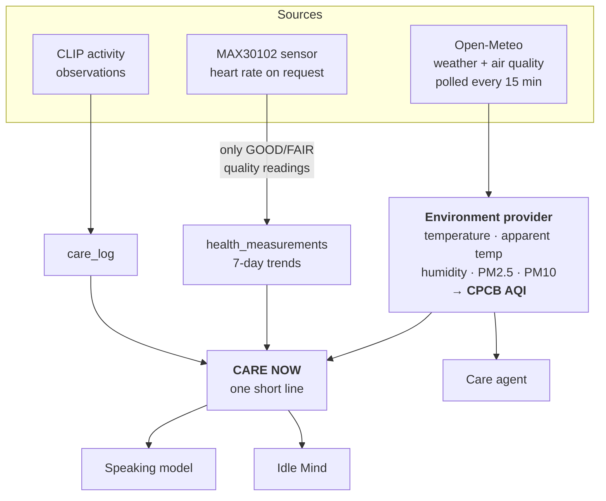

### AQI on India's scale, not America's

Open-Meteo returns US and European AQI. Neither is what a Delhi advisory, a news bulletin, or a doctor means by "AQI". So the codebase computes **India's CPCB AQI** from the PM2.5 and PM10 concentrations — taking the *worse* of the two sub-indices, because CPCB never averages them.

A live reading from Delhi during development:

| | value |
|---|---|
| Temperature | 29.2 °C |
| **Feels like** | **34.8 °C** → heat band `caution` |
| Humidity | 75% |
| PM2.5 | 120.6 µg/m³ |
| PM10 | 338.1 µg/m³ |
| US AQI (from the feed) | 376 |
| **CPCB AQI (computed)** | **301 — "very poor"** |

Heat is banded on **apparent** temperature, not the raw reading: 38 °C in dry Jaipur and 38 °C at 80% humidity in Kolkata are not the same event for someone with a heart condition, and only the apparent figure knows the difference.

### Data has a lifespan

A reading is not just present or absent. It ages:

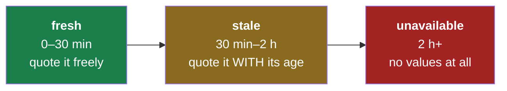

An `unavailable` snapshot deliberately carries **no numbers whatsoever** — not the numbers plus a flag. Returning both would eventually mean some caller renders the numbers and drops the flag, and that is exactly how a two-hour-old AQI gets spoken as the current one.

### CARE NOW — the compact state line

Everything above is compressed into one short line injected into Kiki's context, e.g.:

```
CARE NOW: OUTSIDE New Delhi: feels 34C (caution heat), AQI ~301 very poor
```

Two rules govern it, and both are about not being annoying:

- **Silence is the default.** On an ordinary day with clean air and nothing due, it produces nothing at all.
- **It is injected only when it *changes*.** An unchanged AQI never re-enters the prompt. A person does not need to be told the air is bad every five minutes, and every character of it costs prompt space on every subsequent turn.

---

## 7. Reach — WhatsApp, email, and the family

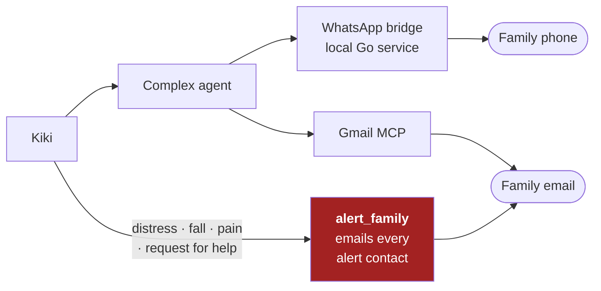

A bundled Go bridge holds the WhatsApp session; a Python MCP server exposes it as tools. Kiki reads the real address book from the bridge's own contact store rather than a hand-maintained list, and fuzzy-matches names — *"project cereal"* resolves to the real group *"project circle club"*. On a genuine tie she **asks** instead of messaging the wrong person.

**Kiki never sends a message on her own initiative.** The Idle Mind reads new messages and may mention something in conversation, but sending requires the person to have actually asked for that exact message.

---

## 8. Three modes, one robot

The same runtime is three different products depending on a config flag. This is done with **capability flags**, not by checking a mode name in a dozen places.

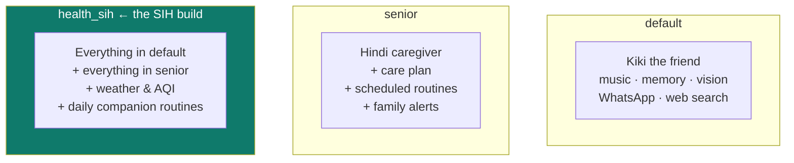

| capability | turns on |
|---|---|
| `care` | care plan, scheduled routines, care agent, family alerts |
| `environment` | weather/AQI polling, CARE NOW snapshot |
| `companion` | the seeded daily routines below |

`health_sih` declares all three. `senior` declares only `care`. `default` declares none.

### The seeded day

Under the `companion` capability, five routines are installed automatically — each one a *brief*, not a script:

| time | routine | what it's for |
|---|---|---|
| 07:30 | **Morning briefing** | How they slept, what today holds, and today's heat/air translated into a practical decision for *this* person's conditions |
| 11:30 | **Water check-in** | Thirty seconds, weighted by how hot it actually is. Explicitly told not to lecture |
| 17:00 | **Movement check-in** | On a bad-air or high-heat day, advising them to stay in and stretch indoors is the *correct* answer |
| 20:30 | **Evening reflection** | The day using **confirmed** outcomes only, mood, gentle follow-up on anything missed, tomorrow's appointments |
| 22:00 | **Bedtime wind-down** | Short and calm. Explicitly forbidden from raising missed items — that was the evening's job, and repeating it just keeps someone awake |

Seeding only ever **adds**. A routine the person retimes, rewrites, disables or deletes stays that way. An assistant that silently restores what you turned off is worse than one that never offered it.

---

# Part B — The UI you are building

## 9. What this app is for

**Kiki is the product. The app is the control surface.** The person being cared for talks to Kiki; they do not use the app. The app is for the **caregiver** — an adult child, usually on a phone, often in another city.

It has exactly three jobs:

1. **Set up** the care plan so Kiki knows the person's day.
2. **Show** what actually happened — truthfully.
3. **Stay out of the way** the rest of the time.

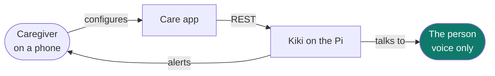

## 10. Stack and deployment

| decision | choice | why |
|---|---|---|
| Framework | **React + TypeScript + Vite** | Fast, familiar, small build |
| Type | **PWA** — installable, offline shell | Caregivers install it once; it must open on a bad connection |
| Served from | **`/care/` on Kiki's existing Flask server, port 8090** | Same-origin. No CORS, no separate host, no second box to keep alive |
| Access | **Tailscale** HTTPS | Works from anywhere without exposing the Pi to the internet |
| Languages | **English + Hindi**, switchable | Non-negotiable for the actual users |
| API base | **`/api/care/v1`** | Versioned from day one |

The Pi is a small computer serving one or two users. Do not ship a 2 MB bundle or poll every 500 ms.

## 11. Screens

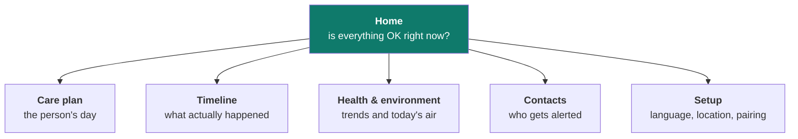

### 11.1 Home — the glance screen

The caregiver opens this fifty times and reads it in three seconds. It answers one question: **is everything OK right now?**

- Kiki online / offline, with last-seen time
- **Next thing due** and when
- Today at a glance: routines completed / missed / upcoming
- Today's **heat and AQI**, with the band as a colour and a word — not a bare number
- Any active alert
- Connector health: WhatsApp paired?, email authorised?, camera alive?

> Encode state in **form as well as number** — a pill, a chip, a severity stripe — so what needs attention reads at a glance without being parsed.

### 11.2 Care plan — the main editing surface

A list of routine events, grouped by time of day. Create, edit, enable/disable, delete.

Fields on each event: title, category, schedule, and the **session brief**.

> **The session brief is the single most important field in this app.** It is not a script and the UI must not make it look like one. Do not offer a step list, a numbered sequence, or a "what Kiki should say" box. Label it something like *"What should Kiki know going into this?"* with helper text explaining that Kiki will hold a real conversation and adapt — the brief is context, not dialogue. Show an example.

Seeded companion routines should be visibly marked as such (they carry a `companion_key`) so a caregiver understands where they came from and that editing them is fine and permanent.

### 11.3 Timeline — what actually happened

Reverse chronological, filterable by day. Each entry: what was scheduled, what state it reached, and — crucially — **how Kiki knows**.

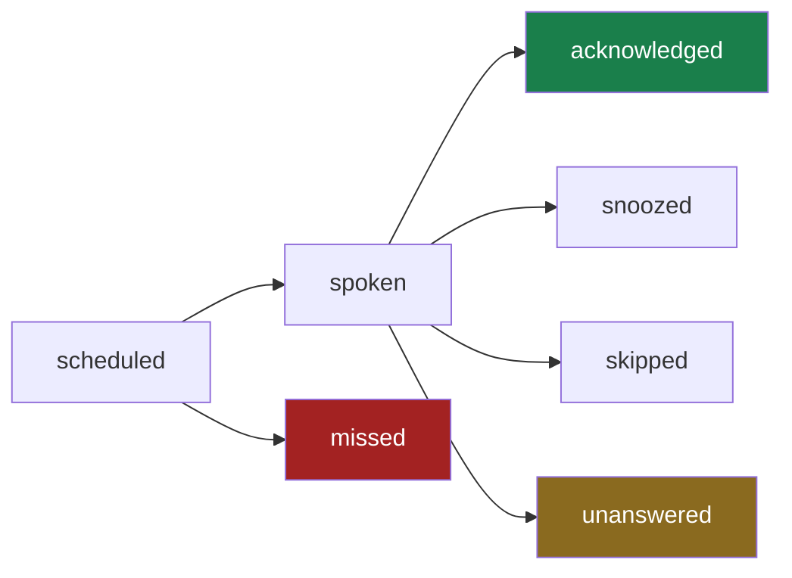

> **Never render "medicine taken" for an event that was merely scheduled.** *Scheduled*, *spoken* and *confirmed* are three different states and the UI must never collapse them. This is the single most important correctness rule in the whole app.

Session entries should show how the session ended — completed, cancelled, declined, or **abandoned** (nobody answered) — because those mean genuinely different things to a worried caregiver.

### 11.4 Health & environment

- **Heart rate trend** — 7-day, from trusted readings only. If there are two readings, draw two points; do not interpolate a reassuring curve.
- **Today's environment** — temperature, apparent temperature, humidity, PM2.5, PM10, CPCB AQI with its category word.
- **Explainable wellness indicators** — heat, respiratory, cardiovascular. Each must show *what it was computed from*. A number nobody can trace is a number nobody should trust.
- **Freshness must be visible.** A stale reading shows its age. An unavailable one shows an empty state — never a stale number without its age, and never a placeholder that looks like data.

### 11.5 Contacts, and 11.6 Setup

Contacts: name, relationship, email, and which events they should be alerted for. A **"send test alert"** button that reports the *actual* delivery result.

Setup: UI language, Kiki's spoken language, home coordinates (these drive weather and AQI), WhatsApp QR pairing, Gmail authorisation.

## 12. The API

**None of these endpoints exist yet.** They are the contract to build against; the underlying data and logic all exist today in `care_plan.json` and `core/senior/`. Agree the shapes before either side starts.

```
GET    /api/care/v1/status              Kiki health, next due, connector states
GET    /api/care/v1/plan                whole care plan + revision
PATCH  /api/care/v1/plan/senior         name, language, health conditions

GET    /api/care/v1/routines            list routine events
POST   /api/care/v1/routines            create
PATCH  /api/care/v1/routines/:id        edit
DELETE /api/care/v1/routines/:id        delete
GET    /api/care/v1/routines/:id/receipt  VERIFIED next trigger time

GET    /api/care/v1/timeline?date=      care log + session history, merged
GET    /api/care/v1/sessions/:id        one session with its transcript

GET    /api/care/v1/environment         current snapshot + freshness
GET    /api/care/v1/measurements        trusted readings + 7-day trend

GET    /api/care/v1/contacts            list
POST   /api/care/v1/contacts            add
DELETE /api/care/v1/contacts/:name      remove
POST   /api/care/v1/contacts/:name/test send a real test, return real result
```

### Data shapes — these are real, from the live plan

A routine event:

```json
{
  "id": "b13cfdb6",
  "title": "Morning briefing",
  "objective": "Start the day together.",
  "category": "morning",
  "schedule": { "kind": "daily", "value": "07:30" },
  "session_brief": "This is the first proper conversation of the day...",
  "continuous_vision": false,
  "enabled": true,
  "source": "companion_default",
  "companion_key": "morning_briefing",
  "created_at": "2026-08-30T07:12:04",
  "updated_at": "2026-08-30T07:12:04"
}
```

`schedule.kind` is one of three, and nothing else:

| kind | value | meaning |
|---|---|---|
| `daily` | `"07:30"` | every day at that time |
| `once` | `"2026-09-01T18:40:00"` | one time only |
| `recurring` | `3600` | every N seconds |

`category` is one of: `morning`, `medicine`, `hydration`, `meal`, `exercise`, `sleep`, `appointment`, `wellbeing`, `memory`, `social`, `safety`, `vitals`, `other`.

A finished session:

```json
{
  "id": "b96ab5f7",
  "event_title": "Surya Namaskar",
  "status": "abandoned",
  "end_reason": "no activity for 85 min (timeout 20 min)",
  "started_at": "2026-08-29T22:27:28",
  "completed_at": "2026-08-29T23:54:06",
  "turn_count": 5
}
```

An environment snapshot:

```json
{
  "available": true,
  "state": "fresh",
  "age_seconds": 240,
  "place": "New Delhi",
  "temperature_c": 29.2,
  "apparent_temperature_c": 34.8,
  "humidity_pct": 75,
  "pm2_5": 120.6,
  "pm10": 338.1,
  "aqi": 301,
  "aqi_category": "very poor",
  "aqi_driver": "PM2.5",
  "aqi_scale": "CPCB (estimated from current hourly PM, not a 24h average)",
  "heat_band": "caution"
}
```

> Render `aqi_scale` somewhere the user can find it. The number is an honest estimate on the CPCB scale, not a government station reading, and the UI must not present it as one.

### Two API rules

**1. A write returns the updated resource and a new plan revision.** Send the revision back on the next write; a mismatch means someone else changed the plan and the client must re-read. This is how offline edits sync safely.

**2. Scheduling something is not the same as it being scheduled.** After creating a routine, the UI must confirm via the **receipt** endpoint, which reports the actual next trigger time from the running scheduler. Only then show it as active. Kiki herself is held to this rule and so is the app — this is the same "never claim an unverified success" principle from Part A, at the API layer.

## 13. Offline behaviour

Caregivers open this on trains.

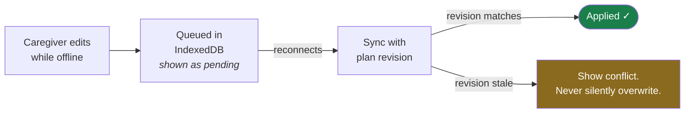

Cache the app shell and the last read-only state. Queue edits **visibly** — a caregiver must never think they changed a medicine time when they didn't.

---

## 14. Non-negotiables

These are not style preferences. Each one exists because of a real failure, and violating any of them makes the product worse than not having it.

| | rule |
|---|---|
| **1** | **Never show an unconfirmed thing as confirmed.** Scheduled ≠ spoken ≠ acknowledged. If Kiki does not know whether a medicine was taken, the UI says so. |
| **2** | **Never invent a number.** No placeholder vitals, no interpolated readings, no filler AQI. An empty state is always correct; a plausible fake never is. |
| **3** | **Never present absence of data as a medical event.** "Not visible to the camera" means the camera cannot see them. It does not mean they fell. |
| **4** | **Show data age wherever data appears.** Stale is fine and often useful. Stale *presented as current* is a lie. |
| **5** | **No diagnosis, anywhere.** Kiki does not name diseases, interpret symptoms as conditions, or suggest changing a medicine. Neither does the app. Wellness indicators are explainable observations, not findings. |
| **6** | **A destructive action confirms.** Deleting a routine or a contact affects a real person's day. |
| **7** | **Hindi is a first-class language, not a translation layer.** The person's language and the caregiver's may differ, and both must work properly. |

---

## 15. What exists today, and what does not

**Working now:** the voice pipeline, the care plan and scheduler, adaptive care sessions with live camera vision, heart-rate measurement, the CLIP activity cascade, weather and CPCB AQI, the CARE NOW snapshot, the seeded daily routines, WhatsApp and email reach, family alerts, and the three modes. Test suite: **794 passing**.

**Not built yet — this is the work being handed over:** the `/api/care/v1` layer, and the entire caregiver app. Also still open on the Kiki side: medicine occurrence state machine, structured memory aids, and wearable integration (fall detection, continuous vitals, sleep — all explicitly deferred until there is real hardware, because a software-only version of any of them would lie).

---

## 16. Where to look in the code

| what | where |
|---|---|
| Full architecture reference | `docs/ARCHITECTURE.md` |
| Phased plan + status | `docs/SENIOR_CARE_ROADMAP.md` |
| Care plan data model | `core/senior/care_plan.py` |
| Live care sessions | `core/senior/care_voice_agent.py` |
| Scheduling | `core/senior/senior_care_manager.py` |
| Weather + CPCB AQI | `core/health/environment.py` |
| CARE NOW snapshot | `core/health/care_snapshot.py` |
| Seeded daily routines | `core/health/companion_routines.py` |
| Activity detection gates 4–5 | `core/senior/health_events.py` |
| Complex agent | `core/brain/action_agent.py` |
| Background thinking | `core/brain/unified_idle_mind.py` |
| Speaking path + KV cache | `core/llm.py`, `core/local_llm.py` |
| Existing dashboard to extend | `webui/server.py` |
| Modes and capabilities | `core/runtime_controls.py`, `tools_and_config/config.json` |

**Run the tests before and after any change:**

```bash
~/Kiki/kiki/bin/python -m pytest tests/ -q
```

Nine failures are pre-existing and unrelated (`test_history_view`, `test_startup_config`). Everything else must stay green.
